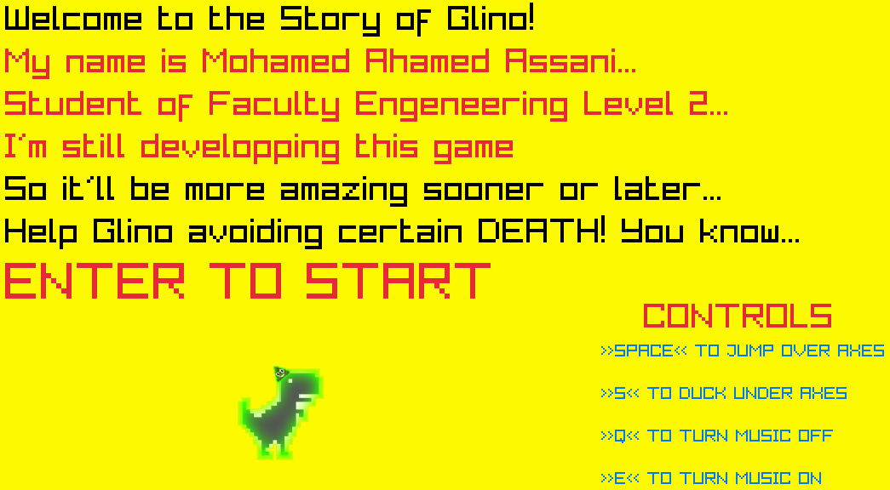
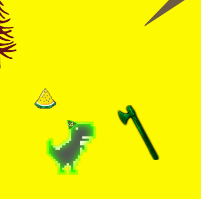
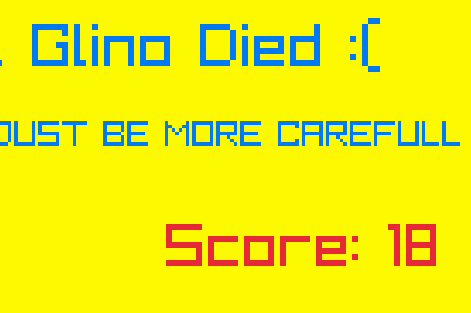

# Guino-Game 🦖
​Welcome to Guino-Game, a classic arcade-style side-scroller built entirely in C++. 
Take control of the hero, dodge obstacles, and aim for the high score!

​#🚀 How to Run the Game
​This project includes pre-compiled executables for Windows. 
You don't need to install a compiler to play; simply download the folder and run one of the following:
​Dino_game.exe (Recommended)
​main.exe
​Note: Make sure to keep the .exe files in the same folder as the other project files so the game assets load correctly.

​#🎮 Controls
​The game is designed to be simple and addictive. Use the following keys to play:
Action:	Key

Jump:	Space

Duck:	S

Music ON:	Q

Music OFF:	E

Restart Game:	ENTER (After Game Over)

## 📸Screenshots

### Main Menu

### Gameplay

### Game Over

#🛠️ Technical Details
​Language: C++
​Platform: Windows
​Category: Game Development / Programming

